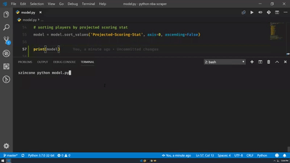

# NBA Predictive Model
Predictive statistical model (NBA) built using web-scraper data and pandas. :crystal_ball:

- Uses [Pandas](https://pandas.pydata.org/), [BeautifulSoup](https://www.crummy.com/software/BeautifulSoup/), and [Requests](http://docs.python-requests.org/en/master/).


## how to use
- Fork and clone.
- Create your dotenv file.
    - Add the url of the team and player stats websites that will be scraped as variables.
- `print(model)` variable found in model.py.
    - Returns a pandas dataframe containing players sorted by their projected scoring.



## sample .env file
```
team_stats_url=https://www.team-stats-site-to-be-scraped.com
player_stats_url=https://www.player-stats-site-to-be-scraped.com
```

## authors
- Sawyer Zincone -_initial work_- [szincone](https://github.com/szincone) :clubs:

## license
This project is licensed under the MIT License - see the [LICENSE](https://github.com/szincone/nba-predictive-model/blob/master/LICENSE) file for details.

[](https://opensource.org/licenses/MIT)